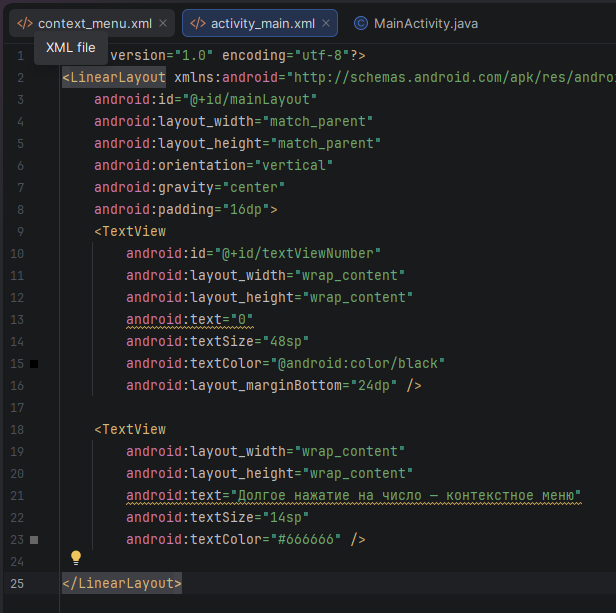
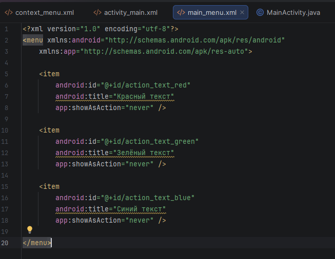
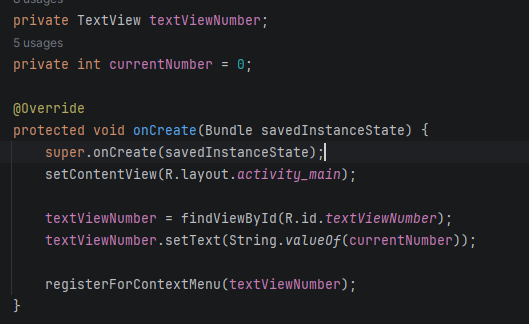
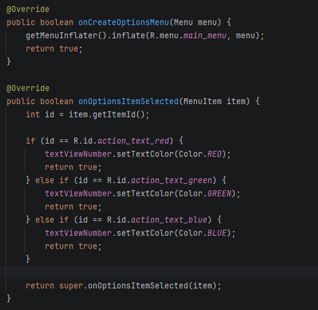
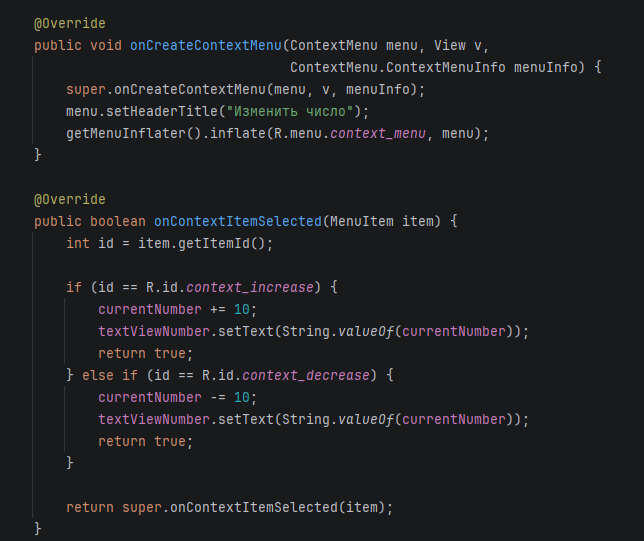
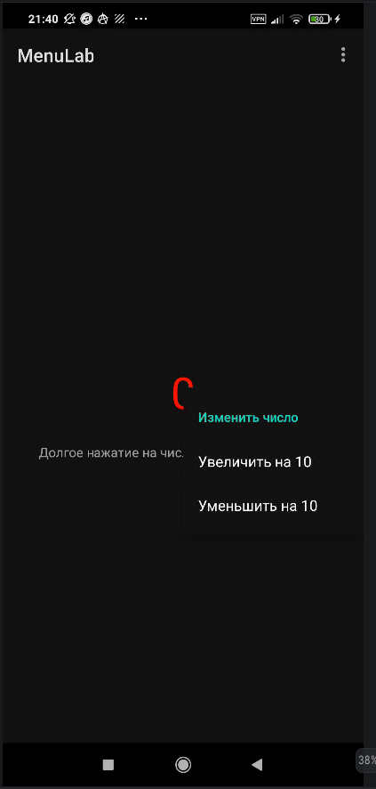

# Отчет

## Практическая работа №9

## Создание меню

**Выполнил:**  
Тушканов Виктор Алексеевич  
**Курс:** 2  
**Группа:** ИНС-б-о-24-1  
**Направление:** 09.03.02 «Информационные системы и технологии»  
**Профиль:** «Прикладное программирование в интеллектуальных информационных системах»  

---

### Цель работы

Изучить способы создания и обработки событий от различных типов меню в Android: главного меню (OptionsMenu) и контекстного меню (ContextMenu). Научиться динамически изменять интерфейс приложения с помощью пунктов меню.

В соответствии с **вариантом 4** требовалось реализовать приложение, в котором:

- **главное меню (OptionsMenu)** изменяет цвет текста в `TextView`, где отображается число (изначально 0), — предусмотрены три цвета;
- **контекстное меню (ContextMenu)** этого же `TextView` содержит пункты «Увеличить на 10» и «Уменьшить на 10», изменяющие записанное в `TextView` число.

### Ход работы

Был создан новый проект `MenuLab` на основе шаблона **Empty Views Activity** (язык — Java).

**1. Подготовка интерфейса.** В файле `activity_main.xml` размещён вертикальный `LinearLayout` с идентификатором `mainLayout`. Внутри него расположен основной `TextView` (`textViewNumber`) с начальным значением «0» и крупным размером шрифта, а также вспомогательный `TextView` с подсказкой о вызове контекстного меню долгим нажатием.

*Рисунок 1. Разметка интерфейса (activity_main.xml)*

**2. Создание главного меню.** В каталоге `res/menu/` создан файл `main_menu.xml` с тремя пунктами для смены цвета текста: «Красный текст», «Зелёный текст» и «Синий текст». Для всех пунктов задан атрибут `app:showAsAction="never"`, поэтому они отображаются в выпадающем меню по нажатию на три точки.

*Рисунок 2. Описание главного меню (main_menu.xml)*

**3. Создание контекстного меню.** В том же каталоге `res/menu/` создан файл `context_menu.xml` с двумя пунктами — «Увеличить на 10» (`context_increase`) и «Уменьшить на 10» (`context_decrease`).

**4. Реализация логики в `MainActivity.java`.** В методе `onCreate()` выполняется поиск `TextView` по идентификатору, установка начального значения числа и регистрация `TextView` для контекстного меню вызовом `registerForContextMenu()`.

*Рисунок 3. Инициализация и регистрация View для контекстного меню (onCreate)*

Для работы главного меню переопределены методы `onCreateOptionsMenu()` (загрузка меню из XML через `MenuInflater`) и `onOptionsItemSelected()` (обработка выбора пунктов и смена цвета текста методом `setTextColor()`).

*Рисунок 4. Создание и обработка главного меню (onCreateOptionsMenu, onOptionsItemSelected)*

Для работы контекстного меню переопределены методы `onCreateContextMenu()` (задание заголовка и загрузка пунктов из XML) и `onContextItemSelected()`. В последнем хранящееся в поле `currentNumber` число изменяется на ±10, после чего обновляется текст `TextView`.

*Рисунок 5. Создание и обработка контекстного меню (onCreateContextMenu, onContextItemSelected)*

**5. Тестирование.** После запуска приложения на экране отображается число «0» и подсказка. Главное меню вызывается нажатием на три точки в ActionBar, контекстное меню — долгим нажатием на число.

*Рисунок 6. Общий вид приложения (главное окно)*

*Рисунок 7. Главное меню: выбор цвета текста*

*Рисунок 8. Контекстное меню: изменение числа на ±10*

### Вывод

В результате выполнения практической работы я изучил основные типы меню в Android — главное меню (OptionsMenu) и контекстное меню (ContextMenu) — и научился создавать их как через XML-ресурсы в каталоге `res/menu/`, так и обрабатывать события выбора пунктов. Я освоил переопределение методов `onCreateOptionsMenu()`, `onOptionsItemSelected()`, `onCreateContextMenu()` и `onContextItemSelected()`, а также регистрацию элементов интерфейса для контекстного меню с помощью `registerForContextMenu()`. Разработанное приложение динамически изменяет интерфейс: главное меню переключает цвет текста, а контекстное меню изменяет отображаемое число, что полностью соответствует заданию варианта 4.

### Ответы на контрольные вопросы

1.  **Какие типы меню существуют в Android? Опишите их назначение.**
    В Android выделяют три основных типа меню. **OptionsMenu (главное меню)** вызывается нажатием на кнопку меню в панели действий (ActionBar, обычно три точки) и используется для глобальных действий приложения — настроек, поиска, выхода. **ContextMenu (контекстное меню)** появляется при долгом нажатии на элемент интерфейса и предоставляет действия, специфичные именно для этого элемента (аналог правого клика мыши). **PopupMenu (всплывающее меню)** привязано к конкретному View и появляется по обычному нажатию (например, на кнопку), не перекрывая весь экран.

2.  **Как создать главное меню (OptionsMenu)? Какие методы необходимо переопределить в Activity?**
    Сначала меню описывается в XML-файле в каталоге `res/menu/` (корневой тег `<menu>`, пункты — теги `<item>`). Затем в Activity переопределяются два метода: `onCreateOptionsMenu(Menu menu)` — в нём меню загружается из XML с помощью `getMenuInflater().inflate(...)` и возвращается `true`; и `onOptionsItemSelected(MenuItem item)` — в нём по `item.getItemId()` определяется выбранный пункт и выполняется соответствующее действие.

3.  **Для чего используется атрибут `app:showAsAction`? Какие значения он может принимать?**
    Атрибут `app:showAsAction` определяет, будет ли пункт меню отображаться непосредственно в ActionBar (как кнопка/значок) или будет скрыт в выпадающем меню. Основные значения: `ifRoom` — показывать, если в панели есть свободное место; `never` — всегда скрывать в выпадающем меню; `always` — всегда показывать в панели (не рекомендуется, так как места может не хватить). Дополнительно используются `withText` (показывать вместе с текстом) и `collapseActionView` (для сворачиваемых action-view).

4.  **Как зарегистрировать View для контекстного меню? В каком методе это обычно делается?**
    View регистрируется методом `registerForContextMenu(View view)`. Обычно это делается в методе `onCreate()` после того, как нужный элемент найден через `findViewById()`. После регистрации View автоматически становится «long-clickable», и долгое нажатие на нём вызывает контекстное меню.

5.  **В чём разница между методами `onCreateContextMenu` и `onContextItemSelected`?**
    Метод `onCreateContextMenu()` вызывается в момент создания меню — перед его показом, и служит для наполнения меню пунктами (загрузка из XML или динамическое добавление через `menu.add(...)`), а также для задания заголовка `setHeaderTitle()`. Метод `onContextItemSelected()` вызывается уже после того, как пользователь выбрал конкретный пункт, и служит для обработки этого выбора и выполнения соответствующего действия.

6.  **Как создать контекстное меню динамически (программно), без использования XML-ресурса?**
    В методе `onCreateContextMenu()` пункты добавляются программно методом `menu.add(int groupId, int itemId, int order, CharSequence title)`. Например: `menu.add(0, 1, 0, "Увеличить");`. Идентификаторы пунктов (`itemId`) затем используются в `onContextItemSelected()` для определения выбранного действия через `item.getItemId()`.

7.  **Что возвращают методы `onOptionsItemSelected` и `onContextItemSelected`? Что означает возврат `true`?**
    Оба метода возвращают значение типа `boolean`. Возврат `true` означает, что событие выбора пункта меню полностью обработано и не должно передаваться дальше по цепочке обработчиков. Если ни один пункт не подошёл, принято возвращать результат вызова родительского метода (`super.onOptionsItemSelected(item)` / `super.onContextItemSelected(item)`), который обеспечивает стандартную обработку.

8.  **Как определить, для какого именно элемента было вызвано контекстное меню, если зарегистрировано несколько View?**
    В метод `onCreateContextMenu(ContextMenu menu, View v, ...)` передаётся параметр `v` — это и есть View, на котором вызвано меню; его можно сравнить по `v.getId()` или сохранить ссылку на него в поле класса. В `onContextItemSelected()` определить элемент можно по сохранённой ссылке либо через `item.getMenuInfo()`. Для элементов списков (`ListView`, `GridView`) используется объект `menuInfo`, приводимый к `AdapterView.AdapterContextMenuInfo`, из которого извлекается позиция и идентификатор выбранного элемента.
